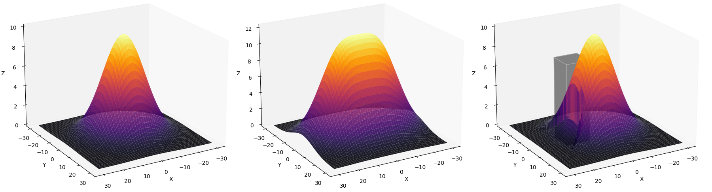
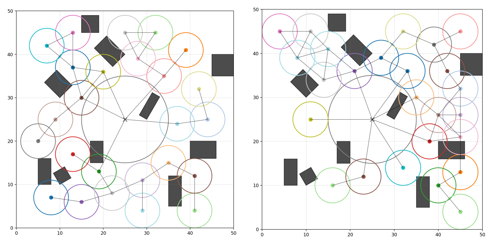

# Multi-Robot Planning for Communication Coverage Optimization

This repository is the final project for Carnegie Mellon University 16-782 Planning and Decision-making in Robotics. We study the problem of multi-robot communication coverage optimization in obstacle-rich environments. The objective is to deploy a team of robots to maximize signal coverage while maintaining connectivity and generating collision-free trajectories. 

<div align="center">
  
  
  
</div>

The signal model assumes Gaussian propagation, characterized by distance-based decay, amplification of overlapping signals, and attenuation due to physical obstacles (occlusion).

<div align="center">
  
</div>

We adopt a hierarchical pipeline:

- **Coverage Optimization**: Generate connectivity-aware target positions
- **Multi-Agent Path Finding (MAPF)**: Coordinate collision-free trajectories to reach the given targets

## Usage
```shell
python main.py --file <map_file> [options]
```

**Arguments**
- `-f`, `--file`: map file (required)
- `-c`, `--cov-opt`: coverage optimizer. 
    - `ga` (genetic algorithm) (default), `pso` (particlee swarm optimization)
- `-p`, `--planner`: multi-agent path finding planner
    - `prioritized` (prioritized planner) (default), `cbs` (conflict-based search)
- `-o`, `--output`: output animation file `*.gif` (optional)

**Example**
```shell
python main.py --file maps/map1.txt --cov-opt ga --planner cbs --output output.gif
```

## Discussion

In general, genetic algorithm is more stable and performs better for larger robot teams. As shown in the figure below, genetic algorithm (right) produces more uniform coverage compared to particle swarm optimization (left).

<div align="center">
  
</div>

For path planning, prioritized planning (farthest-first) provides near-optimal solutions with significantly lower runtime than conflict-based search. Overall, the pipeline achieves high coverage while maintaining connectivity and ensuring collision-free motion.
